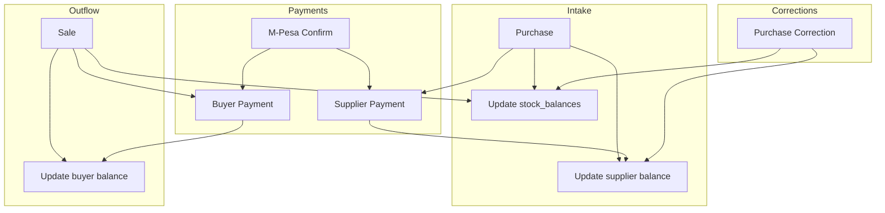

# YardFlow — Transaction Flows

**Status:** Source of truth (pre-implementation)  
**Version:** 1.0  
**Related:** [SYSTEM_RULES.md](./SYSTEM_RULES.md) · [DATABASE_CONTRACTS.md](./DATABASE_CONTRACTS.md) · [EVENT_ARCHITECTURE.md](./EVENT_ARCHITECTURE.md)

---

## 1. Conventions

| Symbol | Meaning |
|--------|---------|
| `[TX]` | Single PostgreSQL transaction; Serializable for stock ops |
| `FOR UPDATE` | Row lock on `stock_balances` or `mpesa_transactions` |
| `PENDING` | No balance projection change until confirmed |
| `FIFO` | Oldest unpaid purchase/sale first |

All flows require valid `tenant_id`, authenticated actor, and permission checks per [PERMISSION_MATRIX.md](./PERMISSION_MATRIX.md).

---

## 2. Purchase Flow

### Purpose
Record scrap entering the yard.

### Actors
Owner, Cashier (`purchase:create`)

### Preconditions
- Tenant `active` or `trial` (not `suspended`)
- Supplier exists or quick-created
- Category `is_active = true`
- `weight_kg > 0`

### Steps

```
1. Select/create supplier
2. Select category (show current stock badge)
3. Enter weight_kg, buying_price_per_kg (default from category)
4. System computes total_value_kes
5. Enter amount_paid_at_creation_kes (0 = full credit)
6. Select payment method if amount > 0
7. Client sends POST /purchases with Idempotency-Key
8. [TX] BEGIN
     a. INSERT purchases
     b. INSERT stock_movements (type=purchase, delta=+weight)
     c. UPDATE stock_balances (weight, avg_cost, version) FOR UPDATE
     d. UPDATE suppliers.balance_kes += (total - paid)
     e. IF paid > 0: INSERT purchase_payments (confirmed)
        → INSERT payment_allocations (FIFO if unlinked)
     f. UPDATE purchase.payment_status (derived)
     g. INSERT ledger_events (PURCHASE_CREATED)
     h. INSERT audit_logs
     i. INSERT receipts (payload snapshot)
   COMMIT
9. Return purchase + receipt_id
10. POS/web triggers print (non-blocking)
```

### Formulas

```txt
total_value_kes = weight_kg × buying_price_per_kg
supplier_balance_delta = total_value_kes - amount_paid_at_creation_kes
stock_delta_kg = +weight_kg
```

### Failure modes

| Condition | HTTP | Behavior |
|-----------|------|----------|
| Suspended tenant | 403 | Reject |
| Duplicate idempotency key | 200 | Return original |
| Invalid weight | 400 | Reject |
| Stock projection update fails | 500 | Full rollback |

---

## 3. Supplier Payment Flow (Balance & Advance)

### Purpose
Pay supplier; support advance and FIFO allocation.

### Actors
Owner, Cashier (`supplier_payment:create`)

### Steps

```
1. Select supplier (show balance_kes + credit_balance_kes)
2. Enter amount_kes, method, optional purchase_id
3. IF M-Pesa B2C:
     a. INSERT mpesa_transactions (PENDING)
     b. Call Daraja B2C API
     c. Return pending payment_id — STOP (no balance change)
   ELSE (cash/manual):
     [TX] confirm immediately (steps 4–8)
4. [TX] INSERT purchase_payments (confirmed)
5. Allocate per SYSTEM_RULES §13 (specific purchase → FIFO → credit pool)
6. INSERT payment_allocations rows
7. UPDATE suppliers.balance_kes and credit_balance_kes
8. UPDATE affected purchases.payment_status
9. INSERT ledger_events (SUPPLIER_PAYMENT_CONFIRMED)
10. INSERT audit_logs + receipt
```

### FIFO example

| Purchase | Remaining | Created |
|----------|----------:|---------|
| P1 | 500 | oldest |
| P2 | 700 | newer |

Payment **800** (unlinked):

| Target | Allocated |
|--------|----------:|
| P1 | 500 |
| P2 | 300 |

P2 remaining = **400**. Credit pool = **0**.

Payment **1200**: P1=500, P2=700, **credit_balance_kes = 0** → wait, 1200-500-700=0.  
Payment **1500**: P1=500, P2=700, **credit_balance_kes = 300**.

### M-Pesa B2C completion (webhook)

```
[TX]
  1. SELECT mpesa_transactions FOR UPDATE
  2. IF already confirmed → COMMIT (idempotent)
  3. UPDATE status = confirmed
  4. Run steps 4–10 from supplier payment flow
COMMIT
```

**Rule:** Do not reduce `suppliers.balance_kes` until payout is **confirmed**.

---

## 4. Sale Flow

### Purpose
Record scrap leaving the yard.

### Actors
Owner, Cashier (`sale:create`)

### Preconditions
- `available_stock_kg >= weight_kg` at commit time

### Steps

```
1. Select/create buyer
2. Select category — display available_stock_kg
3. Enter weight_kg, selling_price_per_kg
4. System computes total_sale_value_kes
5. Enter amount_received_at_creation_kes
6. POST /sales with Idempotency-Key
7. [TX] BEGIN
     a. SELECT stock_balances FOR UPDATE
     b. IF weight_kg < sale_weight → ROLLBACK 409 Insufficient stock
     c. Read avg_cost_per_kg → snapshot cost_per_kg_at_sale, COGS, profit
     d. INSERT sales
     e. INSERT stock_movements (delta=-weight)
     f. UPDATE stock_balances (weight -= sale_weight)
     g. UPDATE buyers.balance_kes += (total - received)
     h. IF received > 0: INSERT sale_payments + allocations
     i. ledger_events (SALE_CREATED), audit, receipt
   COMMIT
8. Print receipt
```

### Concurrency

Two simultaneous sales on last 500 kg: first commit wins; second gets **409** with clear message.

---

## 5. Buyer Payment Flow

### Purpose
Collect money from buyer (balance or linked sale).

### Steps

```
1. Select buyer (show balance_kes)
2. Enter amount, method, optional sale_id
3. IF M-Pesa STK → PENDING path (mirror §3 M-Pesa completion)
4. ELSE [TX] confirmed payment
5. FIFO allocate to oldest unpaid sales
6. UPDATE buyers.balance_kes
7. UPDATE sales.payment_status
8. SUPPLIER_PAYMENT_CONFIRMED → BUYER_PAYMENT_CONFIRMED event
9. Receipt
```

**Rule:** Do not reduce `buyers.balance_kes` until M-Pesa **confirmed**.

---

## 6. M-Pesa STK Push Flow (Inbound)

### Purpose
Collect from buyer or tenant owner (subscription).

### Steps

```
1. Validate amount, phone (+254 normalized)
2. INSERT mpesa_transactions (PENDING, direction=inbound)
3. Daraja STK Push
4. UI shows pending (WebSocket/SSE optional)
5. Safaricom callback → verify signature
6. [TX] idempotent confirm (§3 webhook pattern)
7. Create linked sale_payment OR billing payment
8. UI → confirmed / failed
```

### Timeout

- After ~120s without callback: mark `timeout`  
- Reconciliation job polls Daraja Transaction Status Query  
- Operator may retry with new idempotency key  

---

## 7. Purchase Correction Flow

### Purpose
Fix incorrect purchase without mutating original row.

### Actors
Owner only (`purchase:correct`)

### Steps

```
1. Owner selects purchase
2. Enters weight_delta_kg and/or value_delta_kes, mandatory reason
3. System previews: stock impact, supplier balance impact, billing intake impact
4. Validate: current_stock + weight_delta_kg >= 0
5. IF invalid → 422 block
6. [TX]
     INSERT corrections
     INSERT stock_movements (purchase_correction)
     UPDATE stock_balances
     UPDATE suppliers.balance_kes
     Recompute purchase payment_status
     PURCHASE_CORRECTED event + audit
   COMMIT
```

---

## 8. Sale Correction Flow

### Purpose
Fix incorrect sale.

### Actors
Owner only (`sale:correct`)

### Steps

Similar to §7; may increase stock (negative weight_delta on sale = return to yard). Validate stock and buyer balance impacts. Emit `SALE_CORRECTED`.

---

## 9. Stock Adjustment Flow

### Purpose
Align system stock with physical count.

### Actors
Owner only (`inventory:adjust`)

### Steps

```
1. Select category, signed weight_delta_kg, mandatory reason
2. Preview resulting stock
3. IF resulting < 0 → block
4. [TX]
     INSERT stock_adjustments
     INSERT stock_movements
     UPDATE stock_balances
     STOCK_ADJUSTED event + audit
   COMMIT
```

Does **not** touch supplier/buyer balances.

---

## 10. Receipt Flow

### Purpose
Provide proof of transaction.

### Rule
**Transaction saved first.** Receipt is generated from saved row + allocations.

```
1. Ledger commit succeeds
2. Build payload_json (immutable snapshot)
3. Assign receipt_number (tenant-scoped sequence)
4. INSERT receipts
5. API returns ESC/POS payload + PDF URL
6. POS sends bytes to CS30 Bluetooth printer
7. On print/reprint: RECEIPT_PRINTED event, print_count++
```

**Failed print:** Transaction stands; user retries reprint.

---

## 11. Billing Flow

### Purpose
Charge dealer by monthly net intake.

### Schedule

```
1. billing_cycle closes (calendar month, Africa/Nairobi)
2. Compute monthly_net_intake_kg (see SYSTEM_RULES §17)
3. Assign tier → amount_kes
4. INSERT billing_cycles + invoices
5. STK Push to owner phone
6. On payment confirmed → subscription active, invoice paid
7. If unpaid after grace → tenant status = suspended
```

### Suspension transition

```
past_due → (grace days) → suspended
Emit TENANT_SUSPENDED
Block operational POST routes
Allow billing:pay
```

---

## 12. POS Offline Sync Flow (MVP Queue-Only)

### Purpose
Resilience when network drops; **not** full offline accounting.

```
1. Clerk completes purchase UI offline
2. App persists PendingMutation { type, payload, idempotency_key, created_at }
3. UI shows "Pending sync" badge
4. On connectivity:
     a. Replay mutations in FIFO order
     b. POST with same Idempotency-Key
     c. On 200: remove from queue, fetch receipt for print
     d. On 409 stock: flag mutation failed — clerk resolves manually
     e. On 403 suspended: stop sync, notify user
5. Stock on device is informational only until server confirms
```

**M-Pesa:** Do not mark payment confirmed locally; wait for server.

---

## 13. Idempotency Replay Flow

```
Client retries POST with same Idempotency-Key
  → Server finds existing row by (tenant_id, idempotency_key)
  → Return 200 + original entity (no double stock/balance change)
```

Applies to: purchases, sales, payments, corrections, adjustments.

---

## 14. Flow Dependency Map



---

## 15. Transaction Isolation Summary

| Flow | Isolation | Row locks |
|------|-----------|-----------|
| Purchase | Serializable | `stock_balances` |
| Sale | Serializable | `stock_balances` FOR UPDATE |
| Payment (confirmed) | Read Committed+ | `suppliers` / `buyers` |
| M-Pesa webhook | Serializable | `mpesa_transactions` FOR UPDATE |
| Correction | Serializable | `stock_balances` |
| Adjustment | Serializable | `stock_balances` |
